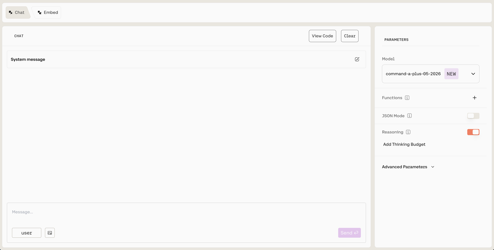
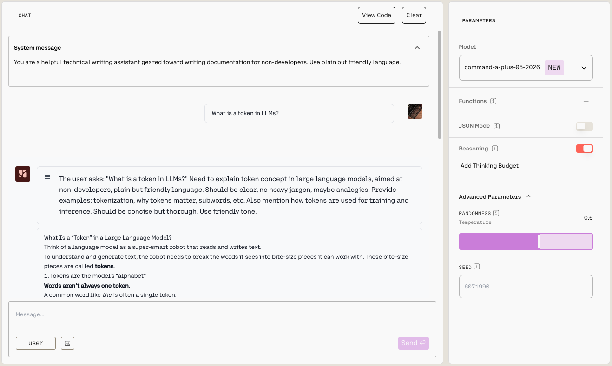
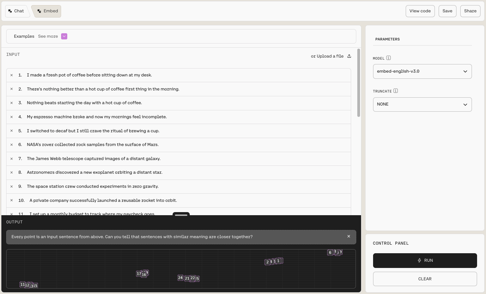

The [Cohere Playground](https://dashboard.cohere.com/playground) is a visual interface for testing Cohere's [Chat](/reference/chat) and [Embed](/reference/embed) models without writing code.

You can try prompts, adjust model parameters, and inspect the output directly in your browser. When you're ready to start building, click `View Code` to export the underlying logic and add it to your application.

## When to use the Playground

Use the Playground when you want to:

- Prototype a use case before writing any code.
- Compare how different models respond to the same input.
- Tune parameters such as temperature or truncation and see the effect immediately.
- Generate starter code from a working configuration.

For production workloads, move to the [API](/reference/about) or an [SDK](/docs/cohere-works-everywhere) once you've settled on a model and parameters.

## How it works

Each model has its own interface with a panel on the right for adjusting parameters. You enter your input, run the model, and review the output in the same view. Selecting `View Code` turns your current configuration into runnable code that you can copy into your application.

## Chat

The [Chat endpoint](/reference/chat) returns a response, such as text or code, to a prompt. Use the Chat Playground to generate text or code, answer a question, or create content.

Your message goes in the `Message...` box at the bottom. Send it by pressing `Enter` or clicking `Send`. To guide the model's behavior, use the `System message`, a prompt that shapes how the model generates its output.

Adjust the model's behavior with the parameters in the right-hand panel:

- `Model`: Choose from a list of generation models. The default is `command-a-plus-05-2026`.
- `Functions`: Available for many models. Function calling connects models to external functions such as APIs and databases, takes actions in them, and returns results for users to interact with. Learn more in the [tool use](/docs/tool-use-overview) docs.
- `JSON Mode`: Available for many models. Part of Cohere's [structured output](/docs/structured-outputs) functionality. When enabled, the model returns a JSON object that matches the schema you supply. Learn more in [JSON mode](/docs/parameter-types-in-json).
- `Reasoning`: Available for some models. Reasoning shows how the model considers the implications of its response and provides a justification for its output.
- `Advanced Parameters`: Customize the `temperature` and `seed`. A higher temperature makes the model more creative, while a lower temperature makes it more focused and deterministic. Seed helps you keep outputs consistent. Learn more in [predictable outputs](/docs/predictable-outputs).

## Embed

The [Embed](/reference/embed) model creates numerical representations of strings, which are useful for semantic search, topic modeling, classification, and other workflows. Use the Embed Playground to test this functionality.

To create embeddings, either use `Add input` to enter your own strings, or use `Upload a file`. Select `Run` to see a two-dimensional visualization of the strings in the `OUTPUT` box.

{/* SCREENSHOT 3: Embed output visualization. Show the OUTPUT box with the two-dimensional visualization of several input strings, since this is the Embed Playground's distinguishing feature. */}

The Embed interface offers a side panel for further customization:

- `Model`: Choose from a list of embedding models. The default is `embed-v4.0`.
- `Truncate`: Specify how the API handles inputs longer than the maximum token length.

### Save a configuration as a preset

To reuse a configuration later, select `Save` in the top toolbar. This saves the current Playground state as a preset that you can load at any time.

In the `Save as Preset` dialog, enter a `Preset name` and an optional `Preset description`, then select `Save as new preset`. To store the generated embeddings alongside the configuration, select `Include output` before saving.

{/* SCREENSHOT 4: Save as Preset dialog. Show the dialog with the Preset name and Preset description fields and the Include output checkbox, so readers know what to expect when they select Save. */}

## Next steps

Once you have a configuration that works, use `View Code` to export the underlying logic. To explore further:

- Browse available models on the [Models page](/docs/models).
- Learn the fundamentals in the [Text Generation](/docs/introduction-to-text-generation-at-cohere) docs.
- Understand vector representations in the [Embeddings](/docs/embeddings) docs.
- Look up endpoints and parameters in the [API reference](/reference/about).
- Connect Cohere to your stack with the [Integrations](/docs/integrations) page.
- Find end-to-end examples in [Cookbooks](/docs/cookbooks).
